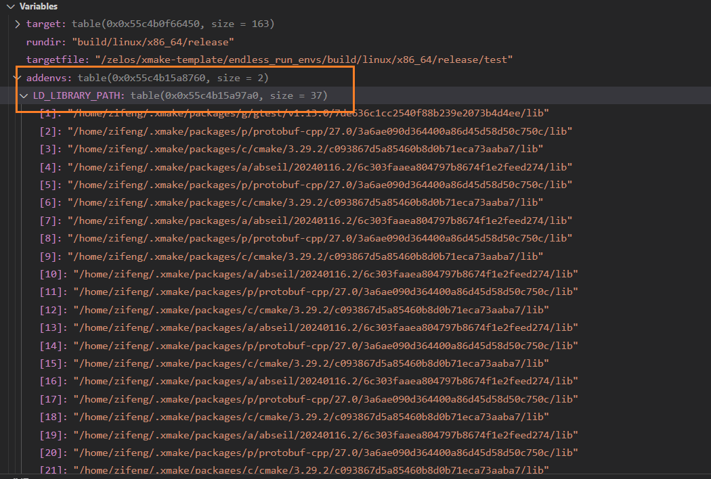

# README

## 问题描述

https://github.com/xmake-io/xmake/issues/5184

`xmake test` 和 `xmake run` 运行单测都失败，手动执行二进制可以正常运行，调试后发现 `os.execv` 中的环境变量长达 1200+，怀疑是这里导致的程序运行失败。

## 测试

```bash
xmake -bvD test
xmake run -v test
```


